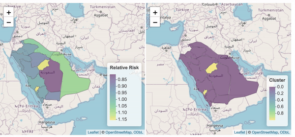

```{r echo=FALSE, message=FALSE, warning=FALSE}

library(readxl)
library(sf)
library(ggplot2)
library(rgeoboundaries)
library(rnaturalearth)
library(dplyr)
library(SpatialEpi)
library(spdep)
library(INLA)
library(sp)
library(Matrix)
library(spData)


##############################
# Get the map of Saudi Arabia
##############################

map <- ne_states(country = "Saudi Arabia", returnclass = "sf")
map$name[1]="Asir"
map$name[2]="Al Bahah"
map$name[3]="Northern Borders"
map$name[4]="Al Jawf"
map$name[5]="Madinah"
map$name[6]="Qassim"
map$name[7]="Riyadh"
map$name[8]="Eastern Province"
map$name[9]="Hail"
map$name[10]= "Jazan"
map$name[11]="Makkah"
map$name[12]="Najran"
map$name[13]="Tabuk"
map <- st_set_crs(map, 4326) #certain projection
map <- map[order(map$name),] #alphabetically ordered
map<-map %>% select(name,geometry)

##################
# Get the data
##################

data <- read.csv("data/fulldata.csv", header = T)


#############################
# Merge the data and the map
#############################


map <- map %>%
  left_join(data, by = "name")


####################################
####################################
              # Diabtes
####################################
####################################

################### Expected ###############


map$E <- expected(
  population = map$population ,
  cases = map$Diabetes, n.strata = 1
)


############## INLA ########################

nb <- poly2nb(map) #converts a spatial object (map) into a matrix (nb) to create a neighbors list based on areas with touching boundraies
nb2INLA("map.adj", nb) #converts the neighbor matrix (nb) to (map.adj) format suitable for INLA

g <- inla.read.graph(filename = "map.adj") # read it in INLA


#the BYM model includes two random effects: u and v
map$re_u <- 1:length(map$name) #call idareau the indices vector for u, set from 1...i
map$re_v <- 1:length(map$name) #call idareav the indices vector for u, set from 1...i


#specify the model formula: the response variable in the left hand-side and the fixed and random effects in the right-hand side
#for u we use the model besag~ CAR dist. and with neighborhood structure, for v we use the model iid (both variables are identical)
formula <- map$Diabetes ~ 1 + f(re_u, model = "besag", graph = g, scale.model = TRUE) + f(re_v, model = "iid") #make the precision parameter of models with different CAR priors comparable


#we fit the model using INLA, assuming a Poisson family
res <- inla(formula, family = "poisson", data = map, E = map$E,
            
            control.predictor = list(compute = TRUE), #compute the posteriors of the predictions
            control.compute = list(return.marginals.predictor = TRUE), verbose = T)


## RR

map$RRC <- res$summary.fitted.values[, "mean"]


## ex

exc <- sapply(res$marginals.fitted.values,
              FUN = function(marg){1 - inla.pmarginal(q = 1.1, marginal = marg)})

map$exc <- exc


```


```{r echo=FALSE, message=FALSE, warning=FALSE, out.width="50%", fig.align='default', eval=FALSE}

library(leaflet)
library(htmltools)

# Create labels for the Relative Risk map (only show population and observed)
labels_rr <- sprintf("<strong>%s</strong><br/>Observed: %s <br/>Population: %s",
  map$name, map$Diabetes, map$population) %>%
  lapply(htmltools::HTML)

# Create color palette for Relative Risk map
pal_rr <- colorNumeric(palette = "viridis", domain = map$RRC)

# Create Relative Risk map
l_rr <- leaflet(map) %>% 
  addTiles() %>%
  addPolygons(color = "grey", weight = 1, fillColor = ~pal_rr(RRC), fillOpacity = 0.5,
              highlightOptions = highlightOptions(weight = 4),
              label = labels_rr,
              labelOptions = labelOptions(style = list("font-weight" = "normal", padding = "3px 8px"),
                                          textsize = "15px", direction = "auto")) %>%
  addLegend(pal = pal_rr, values = ~RRC, opacity = 0.5, title = "Relative Risk", position = "bottomright")

# Create labels for the Cluster map (only show population and observed)
labels_cluster <- sprintf("<strong>%s</strong><br/>Observed: %s <br/>Population: %s",
  map$name, map$Diabetes, map$population) %>%
  lapply(htmltools::HTML)

# Create color palette for Cluster map
pal_cluster <- colorNumeric(palette = "viridis", domain = map$exc)

# Create Cluster map
l_cluster <- leaflet(map) %>%
  addTiles() %>%
  addPolygons(color = "grey", weight = 1, fillColor = ~pal_cluster(exc), fillOpacity = 0.5,
              highlightOptions = highlightOptions(weight = 4),
              label = labels_cluster,
              labelOptions = labelOptions(style = list("font-weight" = "normal", padding = "3px 8px"),
                                          textsize = "15px", direction = "auto")) %>%
  addLegend(pal = pal_cluster, values = ~exc, opacity = 0.5, title = "Cluster", position = "bottomright")

# Display maps side by side using HTML layout
browsable(
  tagList(
    div(style = "display: inline-block; width: 48%;", l_rr),
    div(style = "display: inline-block; width: 48%;", l_cluster)
  )
)


```


{width=6000px}


